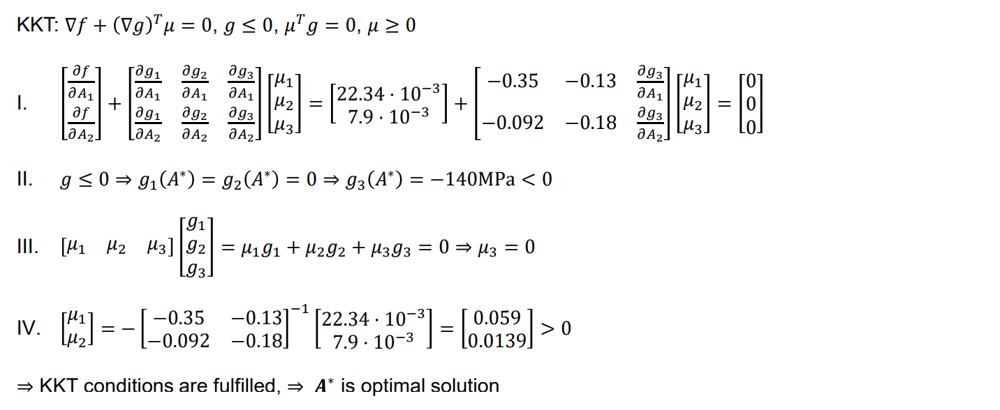

# mdo_summary
#**KKT**

Karush-Kuhn-Tucker (KKT) 条件是一个被用来验证约束优化问题解的最优性的必要条件集。KKT 条件包括：

1. **稳定性**：拉格朗日函数 \( L \) 关于优化变量的梯度在最优解处必须为零。拉格朗日函数是由目标函数 \( f(A) \)、约束函数 \( g_i(A) \) 和拉格朗日乘子 \( \mu_i \) 组成。

2. **原始可行性**：在最优解处，所有的约束 \( g_i(A) \) 必须小于或等于零才被认为是可行的。

3. **对偶可行性**：与不等式约束相关的拉格朗日乘子 \( \mu_i \) 必须大于或等于零。

4. **互补松弛性**：每个约束的拉格朗日乘子和约束函数的乘积必须为零，即 \( \mu_i g_i(A) = 0 \) 对所有的 \( i \) 都成立。这意味着如果 \( g_i(A) < 0 \)（严格满足约束），则 \( \mu_i = 0 \)；如果 \( \mu_i > 0 \)，则 \( g_i(A) = 0 \)（约束是活跃的）。
